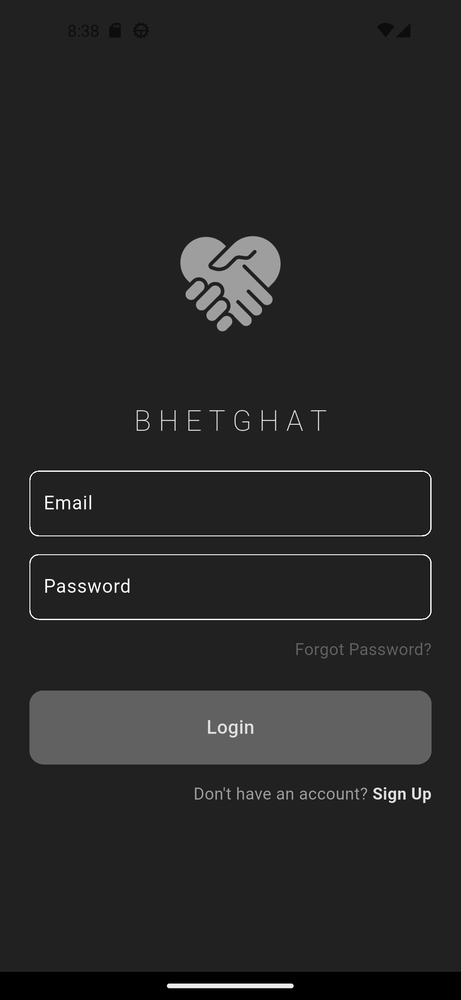

# BhetGhat

A minimal social media application built with Flutter and Firebase, allowing users to register, login, post messages, and interact with a community feed.

## Features

- **User Authentication**: Secure login and registration using Firebase Authentication
- **Social Feed**: Post messages and view posts from other users in real-time
- **User Profiles**: View personal profile information
- **User Directory**: Browse and discover all registered users
- **Theme Support**: Light and dark mode themes
- **Responsive Design**: Clean and intuitive user interface
- **Real-time Updates**: Live feed updates using Firestore streams

## Screenshots

### Login Page


### Registration Page


### Home Feed


### User Profile


### All Users


### Navigation Drawer


## Technologies Used

- **Flutter**: Cross-platform mobile app development framework
- **Firebase Authentication**: User authentication and management
- **Cloud Firestore**: NoSQL database for storing user data and posts
- **Dart**: Programming language for Flutter development

## Installation

1. **Prerequisites**:
   - Install Flutter SDK 
   - Set up Firebase project
   - Configure Firebase for your Flutter app

2. **Clone the repository**:
   ```bash
   git clone https://github.com/4bhisheksharma/bhetghat-app.git
   cd bhetghat
   ```

3. **Install dependencies**:
   ```bash
   flutter pub get
   ```

4. **Firebase Setup**:
   - Add your `google-services.json` (Android) and `GoogleService-Info.plist` (iOS) to the respective directories
   - Update `lib/firebase_options.dart` with your Firebase configuration

5. **Run the app**:
   ```bash
   flutter run
   ```

## Usage

1. **Registration**: Create a new account with username, email, and password
2. **Login**: Sign in with your registered email and password
3. **Post Messages**: Use the text field on the home page to share your thoughts
4. **View Feed**: Scroll through the latest posts from all users
5. **Navigate**: Use the drawer menu to access Profile, Users, or Logout
6. **Theme Toggle**: Switch between light and dark themes (implemented in theme files)

## Project Structure

```
lib/
├── main.dart                 # App entry point
├── controller/
│   ├── auth.dart            # Authentication state management
│   └── login_or_register.dart # Login/Register page toggle
├── database/
│   └── firestore.dart       # Firestore database operations
├── helper/
│   └── helper_funtions.dart # Utility functions
├── pages/
│   ├── auth/
│   │   ├── login_page.dart  # Login page
│   │   └── register_page.dart # Registration page
│   └── content/
│       ├── home_page.dart   # Main feed page
│       ├── profile_page.dart # User profile page
│       └── users_page.dart  # All users list
├── components/
│   ├── my_button.dart       # Custom button component
│   ├── my_text_field.dart   # Custom text field component
│   ├── my_drawer.dart       # Navigation drawer
│   ├── my_list_tile.dart    # Custom list tile for posts
│   ├── my_post_button.dart  # Post button component
│   └── my_back_button.dart  # Back navigation button
└── theme/
    ├── light_mode.dart      # Light theme configuration
    └── dark_mode.dart       # Dark theme configuration
```

## Firebase Configuration

The app uses two main Firestore collections:
- **Users**: Stores user information (email, username)
- **Posts**: Stores user posts (message, email, timestamp)

## Contributing

1. Fork the repository
2. Create a feature branch (`git checkout -b feature/AmazingFeature`)
3. Commit your changes (`git commit -m 'Add some AmazingFeature'`)
4. Push to the branch (`git push origin feature/AmazingFeature`)
5. Open a Pull Request

## License

This project is opensource, anyone can use it.
